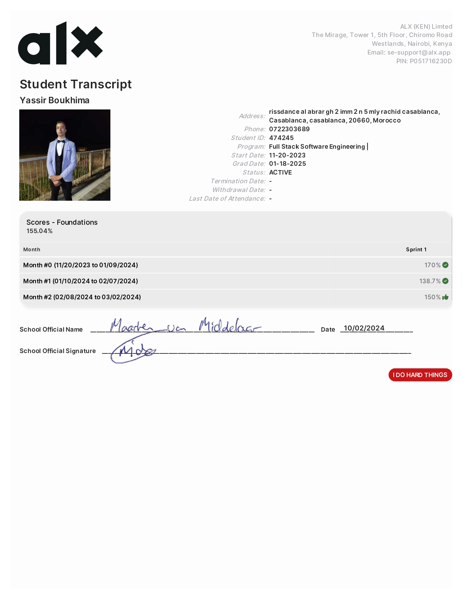

# Yassir BOUKHIMA (etudent)
    Software engineer and Jewellery makeing

## Contact 

### [whatsapp](https://wa.me/qr/3OLKW7HQ75IRH1) / [github](https://github.com/Art-OF-Work/) / [Linkedin]() / [Email](Yassirboukhima.00@gmail.com)

## *Software Engineering Knowledge*

**System Engineering Devops**

    1. Shell Basics
    2. Shell Permissions
    3. Shell Variables Expansions

**Low Level Programming**

     1. Variables If Else While
     2. Functions Nested Loops
     3. Debugging
     4. Pointers Arrays Strings
     5. Recursion
     6. Static Libraries
     7. Argc Argv
     8. Malloc Free
     9. Preprocessor
    10. Structures Typedef
    11. Function Pointers
    12. Variadic Functions
    13. Singly Linked Lists
    14. Bit Manipulation

 [**Tanscript**](https://github.com/Art-OF-Work/About-me/blob/main/Yassir%20Boukhima.pdf)

